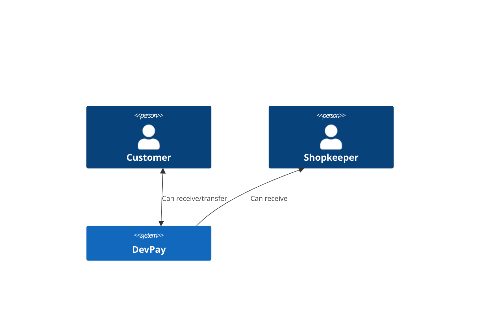

# DevPay

### Steps to install:

```sh
$ cp .env.example .env
$ docker-compose up -d --build
$ docker-compose exec app composer install
$ docker-compose exec app php artisan migrate --seed
```

### Steps to run:
```sh
$ docker-compose up -d
```

### Steps to run tests:

```sh
$ docker-compose exec app vendor/bin/phpunit
```

### Request example:

```
curl -X POST \
  'http://localhost:8080/api/transaction' \
  --header 'Content-Type: application/json' \
  --data-raw '{
  "value": 50.00,
  "payer": 1,
  "payee": 2
}'
```

### Business rules:


